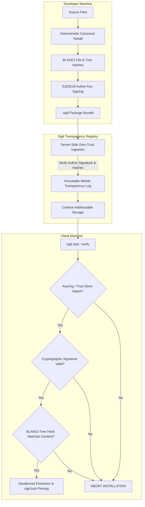

<div align="center">

# 🛡️ Sigil

**The Zero-Trust, Cryptographically Signed Package Distribution & Verification Ecosystem**

[](https://www.rust-lang.org)
[](LICENSE)
[](SECURITY.md)
[]()
[]()

*Eliminating Software Supply Chain Attacks, Rogue Registry Takeovers, and Zero-Day Postinstall Trojans by Design.*

[Key Features](#-key-features) •
[Threat Model](#-threat-model--mitigations) •
[Architecture](#-cryptographic-architecture) •
[Quick Start](#-quick-start) •
[CLI Reference](#-cli-reference) •
[Specification](#-package--manifest-specification) •
[Contributing](#-contributing)

</div>

---

## 📌 Executive Summary

Traditional package managers (`npm`, `pnpm`, `pip`, `rubygems`) operate on implicit trust models established over a decade ago. Central registries, developer credentials, and post-installation scripts have become prime targets for sophisticated supply chain adversaries (e.g., `event-stream`, `colors/faker`, `xz-utils`, dependency confusion).

**Sigil** is an open-source, high-performance package distribution system built from the ground up in **Rust**. It eliminates blind trust by enforcing mathematical proofs at every step:
- **Zero Magic Defaults:** No implicit key lookups or silent fallback directories. Every action requires explicit intent.
- **End-to-End Cryptographic Signatures:** Every package is signed locally by the developer via **Ed25519**; registries cannot forge or alter packages.
- **Immutable Transparency Log:** Cryptographic append-only Merkle ledger prevents split-view attacks.
- **Bit-for-Bit Determinism & BLAKE3 CAS:** All archive entries are canonicalized; a single modified byte breaks the cryptographic seal.
- **Strict Zero-Execution Guarantee:** Absolutely no lifecycle scripts (`preinstall`, `postinstall`).
- **Capability-Based Permissions:** Packages must statically declare what system resources (`network`, `fs_read`, `fs_write`, `env`, `child_process`) they require.

---

## ⚡ Threat Model & Mitigations

| Attack Vector | Traditional Ecosystems (`npm` / `pnpm`) | Sigil Architecture |
| :--- | :--- | :--- |
| **Developer Account Takeover** | Attacker publishes malicious update using stolen session token or 2FA bypass. | **Ed25519 Author Signing:** The central registry does not hold signing keys. Packages without valid author key signatures are rejected. |
| **Malicious Postinstall Scripts** | `postinstall` script executes arbitrarily upon installation, stealing environment secrets (`~/.ssh`, `.env`). | **Zero-Execution Policy:** Package managers should be static file deployers, not execution vectors. No scripts run on install. |
| **Compromised Registry / CDN** | Adversary serves a malicious payload to specific targets (split-view attack). | **Append-Only Merkle Transparency Log:** All releases are immutably chained and auditable by the entire network. |
| **In-Flight Tampering / MITM** | Attacker tampers with tarball; weak or missing signature verification. | **BLAKE3 Merkle Tree:** Every individual file and the root tarball are hashed and signed. Tampering invalidates the envelope. |
| **Dependency Confusion** | Internal corporate package names are hijacked on public registries. | **Explicit Trust Store (Keyring):** Packages scoped under `@org/*` require public keys explicitly pre-authorized in `sigil.trust.json`. |
| **Path Traversal (Zip-Slip)** | Archives containing `../../etc/passwd` overwrite critical operating system files. | **Sandboxed Canonical Extraction:** Strictly rejects absolute paths, directory traversals, and symlink escapes. |

---

## 🏗️ Cryptographic Architecture



---

## 🚀 Quick Start

### 1. Installation

#### Building from Source (Requires Rust 1.75+)
```bash
git clone https://github.com/sigil-security/sigil.git
cd sigil
cargo build --release
```
The compiled binary will be available at `./target/release/sigil`.

---

## 💻 Complete Workflow Walkthrough

### Step 1: Generate an Author Signing Keypair
Unlike legacy tools, Sigil enforces **explicit destination paths**; it will never silently place keys into hidden directories.
```bash
sigil keygen --out ./keys/maintainer_key
```
Outputs:
- `./keys/maintainer_key.key` *(Private Signing Key - Keep safe!)*
- `./keys/maintainer_key.pub` *(Public Verifying Key)*

### Step 2: Initialize a Zero-Trust Manifest
```bash
sigil init --name @acme/secure-core
```
This generates a `sigil.toml` file with all capabilities disabled (`false`) by default.

### Step 3: Package & Cryptographically Seal
Deterministically packs the current directory, computes streaming BLAKE3 Merkle hashes, and signs the envelope using your private key:
```bash
sigil pack --key ./keys/maintainer_key.key
```
Output: `@acme-secure-core-0.1.0.sigil`

### Step 4: Cryptographically Verify Locally
Inspect and audit the cryptographic envelope without running any code:
```bash
sigil verify @acme-secure-core-0.1.0.sigil
```
Enforce specific author public key verification:
```bash
sigil verify @acme-secure-core-0.1.0.sigil --trusted-key <AUTHOR_PUBKEY_HEX>
```

### Step 5: Start a Transparency Registry Server
Launch your own independent, append-only Sigil Transparency Server:
```bash
sigil server start --port 8080 --storage ./registry_storage
```

### Step 6: Publish to the Registry
Publish the signed package. The server independently verifies the signature and cryptographic envelope before accepting it into the Merkle log:
```bash
sigil publish --package ./@acme-secure-core-0.1.0.sigil --registry http://localhost:8080
```

### Step 7: Manage Trusted Publishers (Keyring)
Protect against dependency confusion by binding namespaces to trusted public keys:
```bash
sigil trust add <PUBKEY_HEX> \
  --identity "Lead Security Architect <security@acme.com>" \
  --scope "@acme/*" \
  --store-path ./sigil.trust.json

# View registered keys
sigil trust list --store-path ./sigil.trust.json
```

### Step 8: Client Installation
Clients resolve packages from the registry, verify the author's cryptographic signature locally, cross-reference the trust store, and install with zero-execution isolation:
```bash
sigil add @acme/secure-core --registry http://localhost:8080 --enforce-trust
```

---

## 📜 Package & Manifest Specification

### `sigil.toml` (Project Manifest)
```toml
[package]
name = "@acme/secure-core"
version = "1.0.0"
description = "Hardened core utility library"
authors = ["Acme Security Team <security@acme.com>"]
license = "MIT OR Apache-2.0"

# Explicit capability declaration (Zero-Trust by default)
[capabilities]
allow_network = false
allow_fs_read = false
allow_fs_write = false
allow_env = false
allow_child_process = false

[dependencies]
# Dependencies are pinned to cryptographic identities
```

### `sigil.lock` (Cryptographic Pinning)
Unlike standard lockfiles that merely record weak hash sums, `sigil.lock` binds each dependency directly to the author's public identity:
```toml
version = 1

["@acme/secure-core@1.0.0"]
version = "1.0.0"
content_blake3 = "7b4e99f...8a2"
tree_root_blake3 = "fa108c...3e1"
author_pubkey = "49a1d...e03"
signature = "8f712...99c"

[capabilities]
allow_network = false
allow_fs_read = false
allow_fs_write = false
allow_env = false
allow_child_process = false
```

---

## 🧪 Security Test Suite

Sigil includes an automated security regression suite validating tamper resilience, forgery rejection, and path traversal defenses:

```bash
cargo test
```

### Tested Scenarios:
- [x] **Signature Forgery:** Invalidation of tampered bytes.
- [x] **Content Tampering:** Detection of modified archive bytes even if the envelope header is forged.
- [x] **Untrusted Signer:** Automatic rejection of packages signed by keys not matching `--trusted-key` or `sigil.trust.json`.
- [x] **Path Traversal / Zip-Slip:** Block attempts to extract files outside target sandbox roots (`../`).
- [x] **Merkle Inconsistency:** Detection when internal file listing deviates from canonical tree root.

---

## 📖 Design Principles

> [!IMPORTANT]
> **1. Explicit Over Implicit (No Magic Defaults)**  
> Tools should never guess private key locations or silently load credentials from home directories. All cryptographic keys and storage destinations must be explicitly declared by the operator.

> [!NOTE]
> **2. Zero-Execution Invariant**  
> Package distribution is a transport mechanism, not a remote code execution engine. Script execution during setup is fundamentally flawed and prohibited.

> [!TIP]
> **3. Verifiable Anywhere**  
> Verification requires no external network connectivity. A `.sigil` package bundle contains everything needed to verify integrity and provenance offline against a public key.

---

## 🤝 Contributing

We welcome contributions from security researchers, cryptographers, and systems engineers!

1. Fork the repository.
2. Create your feature branch (`git checkout -b feat/quantum-resistant-signatures`).
3. Commit your changes with signed commits (`git commit -S -m 'Add Dilithium3 support'`).
4. Ensure all tests pass: `cargo test`.
5. Open a Pull Request.

---

## 📄 License

Licensed under either of:
- Apache License, Version 2.0 ([LICENSE-APACHE](LICENSE-APACHE) or http://www.apache.org/licenses/LICENSE-2.0)
- MIT license ([LICENSE-MIT](LICENSE-MIT) or http://opensource.org/licenses/MIT)

at your option.
